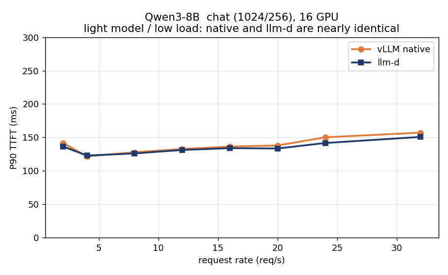
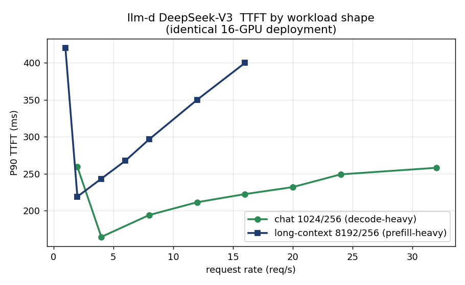
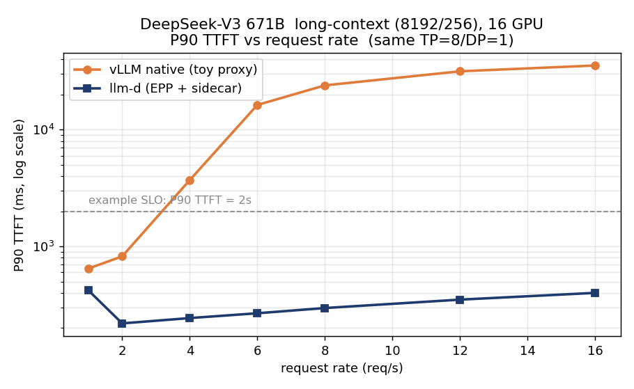
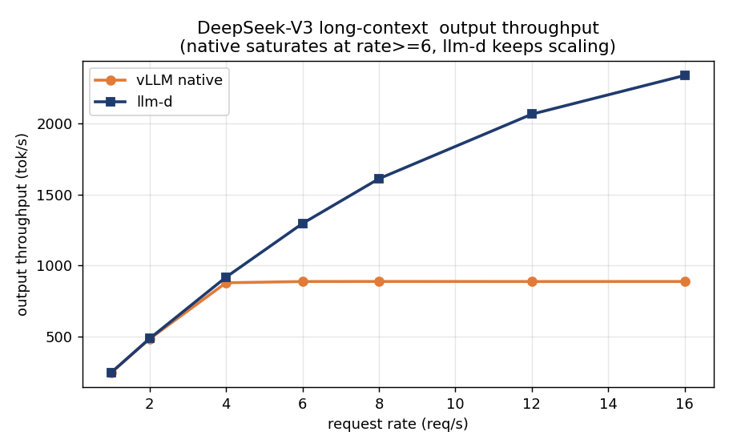

## この記事について

大規模言語モデル（LLM）の推論を高速かつ効率的に提供するための新しい設計、**Disaggregated Inference（推論の分離配置）** を、前提知識のない方でも読めるように順序立てて解説します。

- **前編（本記事）**: なぜ分離するのか、どんな要素技術が必要かを理論から理解します。最後に、実機（NVIDIA B300 × Amazon EKS）で取得した実測結果をグラフで示し、要素技術の重要性を確認します。
- **後編**: Kubernetes 上での実際の構築方法、ハマりどころ、コードの解説を扱います。

本記事では構築手順やトラブルシュートには立ち入りません。「動かす前に知っておくと理解が早い知識」を整理することを目的とします。

:::message
この記事のベンチマークは AWS のブログ [Introducing disaggregated inference on AWS powered by llm-d](https://aws.amazon.com/blogs/machine-learning/introducing-disaggregated-inference-on-aws-powered-by-llm-d/) の考え方を参考に、独自に再現・計測したものです。
:::

---

## 1. LLM 推論は「2つの異なる仕事」でできている

LLM がテキストを生成するとき、処理は性質の大きく異なる2つのフェーズに分かれます。この違いを理解することが、すべての出発点です。

### Prefill（プリフィル）フェーズ

入力されたプロンプト（例: 8000 トークンの長い文書）を**一度にまとめて読み込み**、各トークンの内部表現を計算するフェーズです。

- 入力トークン全体を**並列**に処理できる
- 行列積が大量に発生する → **GPU の計算能力（FLOPS）を使い切る**性質
- この性質を **compute-bound（計算律速）** と呼びます

### Decode（デコード）フェーズ

prefill の後、**1トークンずつ順番に**出力を生成していくフェーズです。「今までの文脈」を踏まえて次の1語を選び、それを入力に加えてまた次の1語を選ぶ、という自己回帰的な繰り返しです。

- 一度に1トークンしか計算しない → GPU の計算能力は余る
- 代わりに、過去の文脈（後述の KV キャッシュ）を毎回読み出す → **メモリ帯域がボトルネック**
- この性質を **memory-bandwidth-bound（メモリ帯域律速）** と呼びます

### 重要な用語: TTFT と TPOT

この2フェーズは、ユーザー体感のレイテンシ指標に直結します。

| 指標 | 読み | 意味 | 主に効くフェーズ |
| --- | --- | --- | --- |
| **TTFT** | Time To First Token | リクエストから**最初の1文字**が返るまでの時間 | Prefill |
| **TPOT** | Time Per Output Token | **2文字目以降**、1トークンあたりの生成時間 | Decode |

チャットで「入力してから返答が出始めるまでの待ち時間」が TTFT、「返答がスラスラ流れる速さ」が TPOT です。

---

## 2. KV キャッシュ ― 分離を可能にする鍵

Decode フェーズで「過去の文脈」と呼んだものの正体が **KV キャッシュ（Key-Value cache）** です。

Transformer の Attention 機構は、各トークンについて Key と Value というベクトルを計算します。生成済みのトークンの Key/Value を毎回再計算するのは無駄なので、**一度計算したらメモリに保存して使い回します**。これが KV キャッシュです。

ここで本質的な事実があります:

> **Prefill フェーズの成果物は、KV キャッシュである。**

つまり prefill は「プロンプトを読んで KV キャッシュを作る仕事」、decode は「その KV キャッシュを受け取って続きを生成する仕事」と言い換えられます。**KV キャッシュさえ受け渡せば、prefill と decode は別の GPU で実行してよい** ― これが分離配置のアイデアの核心です。

---

## 3. なぜ「分離」するのか

### 一体型（Aggregated）の問題

通常の推論サーバーは、同じ GPU 群で prefill も decode も両方こなします（**aggregated**）。これには弱点があります。

- prefill（計算律速）と decode（帯域律速）は**最適なハードウェアの使い方が違う**のに、同じ設定を共有せざるを得ない
- 長いプロンプトの prefill が走っている間、その GPU の decode が**待たされる**（互いに干渉する）。特に「誰かの長文処理」が「他の人の生成」を巻き込んで遅くする

### 分離型（Disaggregated / PD 分離）の発想

そこで、**prefill 専用ノード**と **decode 専用ノード**に役割を分けます（PD = Prefill/Decode）。

```
            ┌─────────────┐         ┌─────────────┐
  入力 ───▶ │ Prefill ノード│ ─KV──▶ │ Decode ノード │ ───▶ 出力
            │ 計算律速向け  │ キャッシュ│ 帯域律速向け  │
            └─────────────┘  転送   └─────────────┘
```

これにより:

- prefill ノードは計算重視、decode ノードは帯域重視と**それぞれ最適化**できる
- 長文 prefill が decode を巻き込まない（**干渉の排除**）→ TPOT が安定する
- prefill と decode の**台数比**を、ワークロードに合わせて調整できる（例: 長文が多いなら prefill を増やす）

ただし、分離には**代償**があります。KV キャッシュをノード間でネットワーク転送する必要があるのです。この転送が遅ければ、分離のメリットは吹き飛びます。だからこそ、次に述べる「速い転送」の技術が決定的に重要になります。

---

## 4. 要素技術 ― 分離を支えるスタック

分離配置を実用にするには、複数の技術が層をなして連携します。下から順に見ていきます。

### 4.1 EFA ― ノード間を結ぶ高速ネットワーク

**EFA（Elastic Fabric Adapter）** は AWS が提供する高性能ネットワークインターフェースです。通常の TCP/IP よりはるかに低遅延・高帯域で、HPC や分散学習で使われてきました。本構成では、KV キャッシュをノード間で運ぶ「土管」の役割を果たします。

### 4.2 GPUDirect RDMA ― CPU を介さない GPU 間転送

KV キャッシュは GPU メモリ上にあります。これを別ノードの GPU へ送るとき、普通なら「GPU → CPU メモリ → ネットワーク → CPU メモリ → GPU」と何度もコピーが発生します。

**GPUDirect RDMA** は、この CPU の中継を飛ばして **GPU メモリから直接ネットワークへ** データを流す技術です。コピー回数が減り、遅延が大きく下がります。

### 4.3 NIXL ― KV キャッシュ転送の抽象化レイヤー

**NIXL（NVIDIA Inference Xfer Library）** は、推論エンジンが「この KV キャッシュをあのノードへ送って」と指示するだけで、裏側で最適な転送経路（EFA + GPUDirect など）を選んで実行してくれるライブラリです。

推論エンジンから見ると、NIXL は「KV キャッシュ転送の共通インターフェース」です。AWS 環境では、NIXL は内部で **libfabric** というライブラリ経由で EFA を駆動します。

### 4.4 推論エンジン（vLLM）と KV コネクタ

**vLLM** は広く使われる OSS の LLM 推論エンジンです。近年、prefill 側で作った KV キャッシュを decode 側へ渡すための **KV コネクタ** という仕組みが入りました。NIXL を使うものは **NixlConnector** と呼ばれます。

vLLM 自身にも「リクエストを prefill 役と decode 役に振り分ける簡易プロキシ」が付属していますが、これは仕組みのデモ用で、賢い負荷分散は行いません（後述の比較で重要になります）。

### 4.5 ルーティング層 ― リクエストをどこへ送るか

複数の prefill / decode ノードがあるとき、「来たリクエストをどのノードに送るか」を判断する層が必要です。ここに2つの選択肢があります。

- **単純なプロキシ**: 順番に振り分けるだけ（ラウンドロビン）。実装は軽いが、ノードの混み具合を考えない。
- **賢いルーター**: 各ノードの混雑度（待ち行列の長さ、KV キャッシュの使用率など）を見て、最適なノードを選ぶ。

後者を Kubernetes 上で実現するのが **llm-d** と、その土台である **Gateway API Inference Extension（GIE）** です。

### 4.6 llm-d / GIE / EPP ― Kubernetes ネイティブな賢いルーティング

**llm-d** は、Red Hat・Google・IBM などが共同開発する、Kubernetes 上で LLM を本番運用するためのスタックです。中核となるのが以下です。

- **InferencePool**: 同じモデルを提供する prefill / decode ノード群を1つの「プール」としてまとめる Kubernetes リソース。
- **EPP（Endpoint Picker）**: リクエストごとに「どのノードへ送るか」を判断する頭脳。各ノードから**待ち行列の深さ・KV キャッシュ使用率・プレフィックスキャッシュの一致**といったメトリクスを集め、スコアリングして最適なノードを選びます。prefill と decode で別々の判断基準を持てます。
- **routing-sidecar**: decode ノードに寄り添い、prefill からの KV キャッシュ受け取りを仲介する補助コンテナ。

つまり llm-d は、4.5 で言う「賢いルーター」を、prefill/decode 分離・KV キャッシュ転送と統合した形で提供します。

### スタック全体像

```
                クライアント
                    │
        ┌───────────▼────────────┐
        │ ルーティング層           │  ← 単純プロキシ  or  llm-d (EPP + InferencePool)
        └───────────┬────────────┘
          ┌─────────┴─────────┐
   ┌──────▼──────┐     ┌──────▼──────┐
   │ Prefill      │     │ Decode       │   ← vLLM + NixlConnector
   │ (計算律速)    │─KV─▶│ (帯域律速)    │
   └─────────────┘     └─────────────┘
          └──── NIXL / libfabric / GPUDirect / EFA ────┘   ← KV キャッシュ転送
```

---

## 5. 「効果があるか」をどう測るか ― Goodput という指標

分離の効果を測るとき、単純な「1秒あたり何トークン出たか（スループット）」では不十分です。なぜなら、**レイテンシ（TTFT/TPOT）が悪化してもスループットだけは出る**ことがあるからです。ユーザーが待たされていては意味がありません。

そこで近年の研究（DistServe, Splitwise, Mooncake など）で標準的に使われるのが **Goodput** です。

> **Goodput = 「決められたレイテンシ目標（SLO）を守れる範囲での、最大の処理レート」**

具体的には:

1. **SLO（Service Level Objective）** を決める。例: 「P90 TTFT ≤ 2秒、P90 TPOT ≤ 50ms」（90% のリクエストがこれを満たす）。
2. リクエストレートを少しずつ上げていく（rate sweep）。
3. **両方の SLO を満たせる最大のレート**が goodput。

レートを上げると、どこかで TTFT や TPOT が SLO を超えます。その**直前のレート**が、そのシステムの「実用上の処理能力」です。これを GPU 1枚あたりに正規化して比較することで、ハードウェア量の差に惑わされない公平な評価ができます。

:::message
**iso-resource（同一リソース）比較が大切**: 「16 GPU の構成 A」と「8 GPU の構成 B」を比べると、単に GPU が多い方が速いのは当たり前です。比較は必ず**同じ GPU 数**で行います。本記事の比較もすべて 16 GPU 同士です。
:::

---

## 6. 実測 ― 要素技術は本当に効くのか

ここからは、実際に **NVIDIA B300（Blackwell 世代）GPU を Amazon EKS 上で 16 GPU 使い**、上記スタックを動かして取得した結果を示します。考察は観測事実の提示に留め、構築方法は後編に譲ります。

計測条件:
- ハードウェア: NVIDIA B300 × 16 GPU（prefill 8 + decode 8 の分離配置、PD 比 1:1）
- KV 転送: 全構成で NIXL / libfabric over EFA
- ワークロード: **chat**（入力1024 / 出力256トークン、decode 重視）と **long-context**（入力8192 / 出力256、prefill 重視）の2種類
- 比較対象: **vLLM 標準プロキシ**（単純な振り分け）と **llm-d**（EPP による賢いルーティング）

### 観測1: 軽いワークロードでは両者ほぼ同じ

まず Qwen3-8B（比較的小さいモデル）の chat ワークロードです。



vLLM 標準プロキシ（オレンジ）と llm-d（紺）は、ほぼ重なっています。レートを 32 req/s まで上げても P90 TTFT は 120〜160ms で安定し、両者に有意な差はありません。

**観測**: 負荷が軽く、モデルも小さい領域では、賢いルーティング層を挟んでも挟まなくても結果は変わりません。llm-d を入れても、その追加レイヤーが性能を悪化させることはない（オーバーヘッドは数 ms 程度）という事実が確認できます。

### 観測2: ワークロードによって挙動が大きく変わる

次に大規模モデル DeepSeek-V3（671B、llm-d 経由）で、chat と long-context を比較します。



同じ 16 GPU の構成でも、chat（緑）はレートを上げても TTFT が低く保たれるのに対し、long-context（紺）はレートとともに TTFT が増えていきます。long-context は1リクエストあたりの prefill 負荷が大きいため、prefill 側が先に詰まり始めるのです。

**観測**: 分離配置の真価が問われるのは、**prefill 負荷の高い long-context ワークロード**です。chat のような decode 重視のワークロードでは、そもそも prefill が詰まらないため差が出にくい、という事実が読み取れます。

### 観測3: long-context で、ルーティング層の違いが決定的になる

最後に、最も重要な結果です。**完全に同じハードウェア・同じモデル・同じ並列度（TP=8）**の DeepSeek-V3 long-context で、vLLM 標準プロキシと llm-d だけを入れ替えて比較しました。



縦軸は対数スケールです。

- **vLLM 標準プロキシ（オレンジ）**: レート 4 req/s までは耐えますが、6 req/s で P90 TTFT が **16秒** に急騰し、その後は数十秒に達します。SLO（例: 2秒、点線）を大きく超えて破綻します。
- **llm-d（紺）**: レート 16 req/s まで上げても P90 TTFT は **400ms 前後** で平坦を保ちます。

スループットで見ても同じ傾向です。



vLLM 標準プロキシ（オレンジ）はレート 6 以上で出力スループットが頭打ちになる一方、llm-d（紺）はレートに応じて伸び続けます。

**観測**: 同一のハードウェアと推論エンジンを使っていても、**リクエストをどう振り分けるかという「ルーティング層」だけで、SLO を守れる処理レートに数倍の差が生じました**。標準プロキシは混雑を考えずに振り分けるため prefill の詰まりが直撃するのに対し、llm-d の EPP は各ノードの待ち行列・KV キャッシュ使用率を見て振り分けるため、詰まりを回避できていると考えられます。

:::message
この数倍差については、純粋に EPP のスケジューリングによるものか、標準プロキシ側の接続・キュー設定の差も含むのか、要因の厳密な切り分けはこの計測では行っていません。ここでは「同一条件で観測された事実」として提示します。
:::

---

## 7. まとめ ― 要素技術の位置づけ

本記事で見てきたことを整理します。

1. **LLM 推論は prefill（計算律速）と decode（帯域律速）という異質な2フェーズ**からなり、その成果物である **KV キャッシュ**を受け渡せば両者を分離できる。
2. 分離の代償は **KV キャッシュのノード間転送**であり、これを実用速度にするのが **NIXL / GPUDirect / EFA** の層。
3. 分離が効くかどうかは**ワークロード依存**で、特に **prefill 負荷の高い long-context** で価値が出る。
4. そして long-context のような厳しい条件では、**リクエストの振り分け方（ルーティング層）** が SLO 達成レートを左右する。賢いルーター（llm-d / EPP）と単純プロキシで、実測で数倍の差が観測された。
5. 一方、軽いモデル・低負荷では差は出ない。**要素技術は「効く条件」を選ぶ**ことを、データが示している。

つまり Disaggregated Inference は「常に速くなる魔法」ではなく、**ワークロードの性質を見極めて、適切な要素技術を組み合わせて初めて効果が出る**設計です。どの層がどこで効くのかを理解することが、実運用の第一歩になります。

---

## 次回（後編）

後編では、ここで示した結果を**実際に再現するための構築方法**を扱います。

- Kubernetes（Amazon EKS）上での環境構築
- vLLM / NIXL / llm-d のデプロイ手順
- B300（最新世代 GPU）特有のハマりどころ
- 実際に動かすコードの解説

実装一式は [github.com/littlemex/distributed-inference](https://github.com/littlemex/distributed-inference) で公開しています。

## 参考文献

- AWS, [Introducing disaggregated inference on AWS powered by llm-d](https://aws.amazon.com/blogs/machine-learning/introducing-disaggregated-inference-on-aws-powered-by-llm-d/)
- DistServe (OSDI'24), Prefill/Decode 分離の goodput 改善
- llm-d project: https://github.com/llm-d/llm-d
- NIXL: https://github.com/ai-dynamo/nixl
- vLLM NixlConnector: https://docs.vllm.ai/en/latest/features/nixl_connector_usage.html
