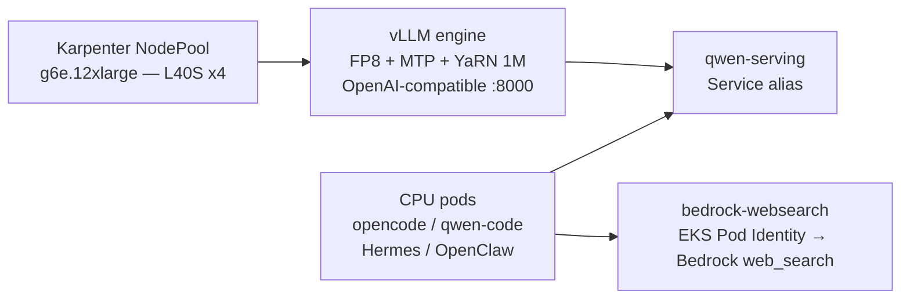

# Qwen3.8-27B on EKS — vLLM serving + self-hosted agents

Reference deployment of `Qwen/Qwen3.8-27B` on EKS. vLLM serves the model with FP8 weights, a
YaRN-extended 1M context, and MTP speculative decoding. MTP, Multi-Token Prediction, is a
self-speculative method that reuses the model's built-in 1-layer MTP head, so it needs no separate
draft model. Four agents — opencode, qwen-code, Hermes, and OpenClaw — run against the self-hosted
backend, and a Bedrock `web_search` tool is wired in over EKS Pod Identity. SGLang with DFLASH2, a
separate-draft speculative-decoding method, is available as an opt-in faster engine.

**Status**

| Path | State | Notes |
|---|---|---|
| vLLM (default) | verified | FP8 + MTP(3) + YaRN 1M; tool-calling, image, and video checked. Single-user TPOT ≈ 9.5 ms at short context (c=1, in512/out256, max-model-len 8192, `--ignore-eos`); TPOT rises at the full 1M context. 1M retrieval is not RULER-evaluated. |
| SGLang (opt-in) | experimental | DFLASH2 + FP8 + fp8 KV + YaRN 1M. Promotion criteria not yet met (0/4) — see [`serving/README.md`](serving/README.md). |

The base cluster is not modified. Everything here is removable with the teardown command; nothing
is added to the Terraform-managed `infra/` layer.

## Architecture



The agents target the `qwen-serving` alias, not an engine-specific Service, so switching the active
engine needs no change on the agent side.

## Prerequisites

Bring these yourself:

| Requirement | Detail |
|---|---|
| EKS cluster + Karpenter | reachable via a kubeconfig context; Karpenter provisions the GPU node |
| GPU EC2NodeClass | the pool references a Karpenter EC2NodeClass named `gpu-ddp` (subnet/SG/AMI discovery); edit `serving/pool/nodepool-gpu-l40s.yaml` if yours differs |
| Bedrock role | an IAM role the agents assume for `web_search`, passed as `QWEN_BEDROCK_ROLE_ARN`; grant it Bedrock access and enable model access in `QWEN_BEDROCK_REGION` |
| GPU quota | `Running On-Demand G and VT instances` ≥ 48 vCPU (g6e.12xlarge) |
| CLI tools | `kubectl`, `aws` CLI v2, `helm` 3.x, `python3` |
| Caller IAM | `eks:*PodIdentityAssociation*`, `iam:PassRole`, `sts:GetCallerIdentity` |

This reference assumes a **dedicated cluster**: the GPU pool is part of the workload, and `deploy.sh
--down` removes that cluster-scoped Karpenter NodePool. On a shared cluster, delete only the
namespaced resources (`kubectl delete namespace $QWEN_NAMESPACE` plus the Pod Identity associations)
so you do not remove a pool other workloads rely on.

`deploy.sh` shows the target context, cluster, and account for confirmation before it changes
anything, creates the namespace if it is absent, and for the SGLang engine checks that its image
exists. It does not verify the Pod Identity add-on, the Bedrock role, or the g6e zone offering, so
bring those per the table above.

## Quickstart

```bash
git clone <this repo>
cd <repo>/2026-08-19-qwen3-8-27b-vllm-eks
./scripts/deploy.sh
install -m 755 <(curl -fsSL <commit-pinned-raw-url>/client/qwen-agents.sh) ~/.local/bin/qwen-agents
ln -sf ~/.local/bin/qwen-agents ~/.local/bin/qa
qa opencode
```

`deploy.sh` runs the default vLLM engine, reads the target context from `$QWEN_KUBE_CONTEXT`
defaulting to the current kubeconfig context, and shows the context, cluster ARN, and account for
confirmation before it changes anything. First run takes roughly 10-15 minutes for node
provisioning, image pull, weight download, and warmup, and ends with a smoke check that gates
success. In the launcher install line, `<commit-pinned-raw-url>` is the raw GitHub URL pinned to a
commit and including this dated subdirectory, for example
`https://raw.githubusercontent.com/<owner>/<repo>/<full-sha>/2026-08-19-qwen3-8-27b-vllm-eks`. The
`ln -sf` line adds the short alias `qa`, after which `qa opencode` drops into the opencode TUI from
anywhere. Run `./scripts/deploy.sh --engine sglang` for the opt-in engine after building its image,
described in [`serving/README.md`](serving/README.md).

## Cost and cleanup

The GPU node is billed per hour while running (g6e.12xlarge, on-demand). Tear everything down when
finished:

```bash
./scripts/deploy.sh --down
```

This removes the Deployments for both engines and all four agents, the `qwen-serving` alias, and the
cluster-scoped GPU NodePool. ServiceAccounts, ConfigMaps, and the namespace remain until you delete
the namespace, and Pod Identity associations are removed only when `QWEN_BEDROCK_ROLE_ARN` is set.

## Layout

```
serving/     charts/ and values/ for the vLLM engine (default), sglang/ for the opt-in engine,
             the shared GPU pool, model facts, and the qwen-serving Service alias
agents/      opencode / qwen-code / hermes / openclaw (each self-contained) + shared tools/
client/      qwen-agents.sh launcher (keyless kubectl exec), port-forward.sh
scripts/     deploy.sh (one-shot bring-up and teardown), smoke.py, lint.sh
experiments/ measurements behind the production settings (FP8, MTP) and the opt-in SGLang/DFLASH
             path (concurrency sweep, FP8 latency, SGLang/DFLASH tuning, MTP)
```

## Configuration (environment)

| Variable | Source / default | Overridable |
|---|---|---|
| `QWEN_KUBE_CONTEXT` | current kubeconfig context | yes (deploy confirms) |
| `QWEN_NAMESPACE` | `qwen` | yes |
| `QWEN_REGION` | derived from the context | yes |
| `QWEN_BEDROCK_REGION` | `$QWEN_REGION` | yes |
| account id | `aws sts get-caller-identity` | no (derived from the caller) |
| `QWEN_BEDROCK_ROLE_ARN` | — | yes; required for the agents phase |

## Software versions

| Component | Version |
|---|---|
| vLLM (default engine) | `vllm/vllm-openai:v0.27.1`, unmodified upstream image |
| SGLang (opt-in engine) | built from the upstream commit pinned in `serving/sglang/image/image.env` |
| Model | `Qwen/Qwen3.8-27B`, architecture `Qwen3_5ForConditionalGeneration`, bf16 weights |

The EKS control-plane version and GPU driver are the target cluster's; this reference does not pin
them.

## Access

Agents run in CPU pods and are entered with `kubectl exec` (keyless, no ssh). See
[`ACCESS.md`](ACCESS.md) for per-agent usage and [`agents/README.md`](agents/README.md) for what
each agent is. Licensed under the repository `LICENSE`.
