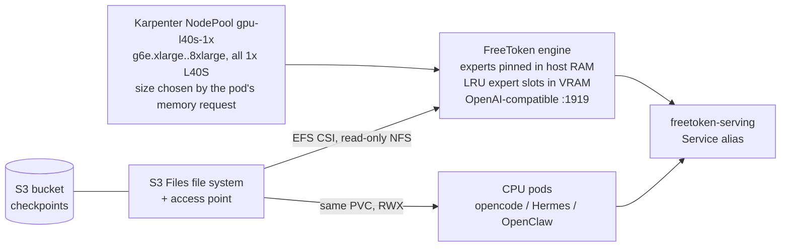

# DeepSeek-V4-Flash on EKS with FreeToken — one L40S, 256 GiB of host RAM

Reference deployment of `deepseek-ai/DeepSeek-V4-Flash-0731` (284B total, 13B active) on EKS using
[FreeToken](https://github.com/FlashML-org/FreeToken), a Mixture-of-Experts serving engine that
keeps the expert set in host RAM and caches only hot expert slots in VRAM. A 284B model is served
from a **single 45 GiB L40S** — the resource that has to be large is system memory, not the GPU.

Agents run against the self-hosted backend, and one Amazon S3 Files file system is mounted
`ReadWriteMany` across the serving pod and every agent pod so a 160 GB checkpoint is downloaded
once rather than per pod.

## The constraint that decides everything

FreeToken's `offload` backend, in its own words, keeps *"experts in host RAM, an LRU cache of expert
slots on GPU; misses stream over PCIe"*. Those host banks are anonymous `mmap` regions that get
`cudaHostRegister`ed with `cudaHostRegisterPortable | cudaHostRegisterMapped`, and the engine states
the size for this checkpoint directly:

> `registering a lazy mmap first faults+zero-fills every page (~137 GiB -> ~47 s for DSV4)`
> — `python/freetoken/moe/host_banks.py`

Three consequences follow, and every design choice in this directory traces back to them.

**Host RAM is a hard floor, and swap cannot move it.** Page-locking *is* the guarantee that the
kernel will never swap a page out, so pinned memory and swap are mutually exclusive by definition,
not by performance. FreeToken has no disk-resident expert path either: the only non-pinned residency
classes are `LOCKED` (which is `mlock` — also non-swappable) and `PAGEABLE`, and both are rejected.

```
raise NotImplementedError(
    "non-pinned host bank layers need platform-specific movement "
    "paths that are not implemented; only pinned layers are served")
```

**VRAM is not the gate.** Every `g6e` size carries the same 45 GiB L40S and differs only in host
RAM. So the model does not pick a GPU, it picks a memory size.

| Instance | L40S | Host RAM | Fits DSV4's 137 GiB of banks |
|---|---|---|---|
| g6e.xlarge | 1 | 32 GiB | no |
| g6e.2xlarge | 1 | 64 GiB | no |
| g6e.4xlarge | 1 | 128 GiB | no |
| **g6e.8xlarge** | 1 | **256 GiB** | **yes** |

**The KV cache and the expert cache compete for the same VRAM.** `--moe-cache-auto` fills VRAM with
expert slots only after `--kv-reserve-tokens` is satisfied, so a large context window is paid for in
expert cache hit rate. This is why the profiles cap context well below the model's native 1M.

## Architecture



The agents target the `freetoken-serving` alias rather than a model-specific Service, so changing
the served model needs no agent change.

## Measured

Verified end to end on a live EKS cluster in `us-east-2`. Full tables, definitions, and caveats are
in [`experiments/README.md`](experiments/README.md).

`deepseek-ai/DeepSeek-V4-Flash-0731` (284B total / 13B active) serving from **one 45 GiB L40S**:

| Config | conc | output tok/s | decode tok/s/stream | TPOT ms |
|---|---|---|---|---|
| offload | 1 | 7.51 – 7.52 | 11.05 – 11.06 | 90.48 – 90.50 |
| offload | 4 | 16.58 – 17.73 | 7.12 | 140.46 – 140.48 |
| hybrid | 1 | 9.03 – 10.07 | 14.69 – 17.68 | 56.57 – 68.06 |
| hybrid | 4 | 19.20 – 20.87 | 9.27 – 10.80 | 92.55 – 107.93 |
| **hybrid, maxRunningRequests 16** | 8 | **30.96** | 5.79 | 172.76 |
| **hybrid, maxRunningRequests 16** | 16 | **41.83** | 3.37 | 296.69 |

Two levers, in order of size. **Concurrency is the larger**: raising `maxRunningRequests` from
FreeToken's default of 4 to 16 reaches 41.83 tok/s, **2.5x the offload/c=4 baseline**, because a
decode step's expert fetches are shared by every request in it. It buys throughput with latency
(per-stream decode 14.2 -> 3.4 tok/s), so it is a batch setting. **`--moe-backend hybrid`** adds
+20-34% at c=1 with non-overlapping sample ranges.

Ranges are min-max over at least three samples, because run-to-run spread on the hybrid path is
about ±10% and single samples cannot resolve an effect that size. Offload, being bandwidth-bound on
a fixed PCIe path, repeats to within 0.1%.

`ft bench bw`, run as an initContainer on the node itself, explains *why*: on this L40S the CPU
retires a `ds_fp4` expert at **61.9 GB/s against PCIe's 13.5 GB/s — a 4.59x ratio**. Notably, the
fetch/compute split it derives (18.5% over PCIe) is **not** measurably better than the conservative
one-fetch-per-layer fallback: the win comes from using the CPU at all, not from tuning the split.

The one number that explains the rest: **only 19.9% of DSV4's 11 008 experts are resident in VRAM**
(`moe_cache_size=2193`), so about four in five expert accesses miss. By contrast `gpt-oss-20b` fits
its entire expert set in VRAM (768 of 768 slots) and reaches 96.9 / 236.5 output tok/s at
concurrency 1 / 4 — which is why the smoke profile proves the plumbing but measures nothing about
offloading.

Load, over the shared S3 Files mount: **143.3 GiB of expert banks at ~546 MB/s, 4 min 38 s**, and
about 6 minutes from process start to serving. Reading the checkpoint in place is therefore a
five-minute cost, not a tens-of-minutes one, so local NVMe staging is not needed to make it viable.

## Two profiles, and why to run both

| Profile | Model | Expert banks | Node | Purpose |
|---|---|---|---|---|
| `smoke` | `openai/gpt-oss-20b` | ~10 GiB | g6e.xlarge | Prove the image, chart, pool, and S3 Files mount cheaply |
| `dsv4` | `deepseek-ai/DeepSeek-V4-Flash-0731` | ~137 GiB | g6e.8xlarge | The real target |

The smoke profile exercises the *same* `--moe-backend offload` code path and reads its checkpoint
over the *same* S3 Files mount. Run it first so that a `dsv4` failure can only be about capacity,
never about plumbing.

Both profiles share one Karpenter NodePool. The pool lists every 1x-L40S `g6e` size and the pod's
memory request selects one, so switching profiles never edits infrastructure — and because every
type in the pool has exactly one GPU, the chart and the pool cannot drift on GPU count.

## Prerequisites

| Requirement | Detail |
|---|---|
| EKS cluster + Karpenter | reachable via a kubeconfig context whose cluster entry is an EKS ARN |
| GPU EC2NodeClass | the pool references an existing EC2NodeClass named `gpu-ddp`; edit `serving/pool/nodepool-gpu-l40s-1x.yaml` if yours differs |
| NVIDIA driver r580+ | CUDA 13.0 needs `>= 580.65.06`. The EKS AL2023 NVIDIA AMI ships 580.178.04, so no GPU Operator driver container and no `cuda-compat` are needed |
| EFS CSI driver v3.0.0+ | S3 Files support landed in v3.0.0; this was verified against v3.3.0 |
| GPU quota | `Running On-Demand G and VT instances` >= 32 vCPU for g6e.8xlarge |
| CLI tools | `kubectl`, `aws` CLI v2 (with `aws s3files`), `helm` 3.x, `python3` + PyYAML, `envsubst` |

Nothing is added to the Terraform-managed `infra/` layer, and the base cluster's configuration is
not modified. See "Blast radius" below for the two cluster-level exceptions.

## Quickstart

```bash
export FT_KUBE_CONTEXT=<your-eks-context>

# 1. Build the FreeToken image (CUDA 13.0.x + nvcc; see serving/image/)
#    Per platform policy, EKS images are built with the in-cluster rootless BuildKit.

# 2. Create the shared S3 Files model cache and wire it into the cluster
./storage/setup-s3files.sh
helm dependency build storage/model-cache
helm upgrade --install freetoken-model-cache storage/model-cache \
  --set volumeHandle="s3files:<fs>::<ap>" --set zone="<az>" --set namespace=freetoken

# 3. Populate a checkpoint (runs as an in-cluster Job, streaming file by file)
./storage/sync-checkpoint.sh openai/gpt-oss-20b

# 4. Smoke on the cheapest node, then run the real thing
./scripts/deploy.sh --profile smoke
python3 scripts/smoke.py --namespace freetoken

./storage/sync-checkpoint.sh deepseek-ai/DeepSeek-V4-Flash-0731
./scripts/deploy.sh --profile dsv4
```

`scripts/smoke.py` reports `/v1/cache/status` as well as the usual health and completion checks. For
an offload deployment that expert-cache hit rate is the most diagnostic number available: a rate
near zero means nearly every token is fetching experts over PCIe, which is the difference between
"working" and "usable".

## What this encodes that is easy to get wrong

- **`volumeHandle` must be `s3files:<FileSystemId>::<AccessPointId>`.** A bare `fs-` id sends the
  EFS CSI driver down the EFS path: it resolves `<fs>.efs.<region>.amazonaws.com`, calls
  `DescribeMountTargets`, gets `file system not found`, and the mount ends in
  `mount.nfs4: mount system call failed`. An access point is mandatory.
- **S3 Files imports metadata lazily.** Opening a deep path before walking its parents can return
  `ENOENT` for an object that exists. FreeToken opens `config.json`, `inference/config.json`, and 46
  shards by exact path, so an initContainer walks the tree first and verifies both config files.
- **DeepSeek-V4 needs its `inference/config.json` subdir.** FreeToken reads the authoritative model
  args from there, so a transfer that flattens directories yields a checkpoint that fails to load
  with every shard present. `storage/sync_checkpoint.py` preserves paths verbatim.
- **One mount target means one AZ.** The NFS endpoint resolves per-AZ, so the PV pins every
  consumer's AZ. `setup-s3files.sh` therefore picks an AZ that actually offers the needed `g6e`
  size instead of taking the first subnet it finds.
- **`ReadOnlyMany` does not work.** The driver does not implement it; the volume is `ReadWriteMany`
  and read-only is enforced by the PV's `-o ro` mount option plus each pod's `readOnly` flag.
- **Fail before the 40-minute mark.** An under-provisioned pod is not slow, it is doomed — but
  without a check it discovers this only after reading the whole checkpoint, as
  `cudaHostRegister failed for N GiB`. A preflight initContainer compares both node `MemTotal` and
  the pod's cgroup limit against the model's pinned requirement and refuses to start with an
  explanation.

## Blast radius on a shared cluster

`storage/setup-s3files.sh` creates only new resources, with two exceptions it prints before acting:

1. It attaches the AWS managed S3 Files policies to the cluster's existing EFS CSI **controller**
   role. Terraform attaches policies non-exclusively, so this does not register as drift.
2. It gives `kube-system/efs-csi-node-sa` a Pod Identity and restarts `ds/efs-csi-node`, because
   Pod Identity credentials are injected at pod-create time. This changes the credential the node
   plugin uses for *all* of its work, EFS included, which is why the new role also carries
   `AmazonEFSCSIDriverPolicy` — without it, enabling S3 Files would break every existing EFS mount
   with `access denied by server`.

`--down` reverses both. Tear this stack down before applying `infra/eks` with `s3files_enabled=true`,
or the two will contend for the same Pod Identity association.

## Cost

g6e.8xlarge is roughly USD 4.53/hour on-demand in us-east-2; g6e.xlarge is far cheaper, which is the
point of the smoke profile. The NodePool's disruption budget is an absolute `1` rather than a
percentage for this reason: a percentage floors to zero on a pool with fewer than ten nodes, which
would block consolidation and leave an idle GPU node billing indefinitely. Tear down with `./scripts/deploy.sh --down`, which keeps the shared
NodePool unless `--purge-pool` is passed, and `./storage/setup-s3files.sh --down` for the file
system. The S3 bucket is kept deliberately, since it holds the checkpoints.

## Layout

```
serving/    charts/freetoken-serving (the engine), values/ (two profiles), models/ (facts only),
            pool/ (one AZ-agnostic 1x-L40S NodePool), image/ (CUDA 13.0.x + FreeToken)
storage/    setup-s3files.sh (file system + access point + mount target + IAM), model-cache/
            (PV/PVC via infra/eks/charts/s3files-lib), sync-checkpoint.sh + sync_checkpoint.py
agents/     opencode / hermes / openclaw, each mounting the shared checkpoint volume
scripts/    deploy.sh (bring-up and teardown), smoke.py, lint.sh
```

`serving/models/*.yaml` holds only mechanically verifiable facts; the tuning those facts justify
lives in `serving/values/*.values.yaml`. The split exists so a number like "137 GiB of expert
banks" is stated once, with its source, and every knob that depends on it can be traced back.

## Software versions

| Component | Version |
|---|---|
| FreeToken | built from the commit pinned in `serving/image/image.env` |
| CUDA base image | `nvidia/cuda:13.0.3-devel-ubuntu24.04`, pinned to 13.0.x to match a 580-series driver |
| EFS CSI driver | v3.3.0 (S3 Files needs >= v3.0.0) |
| Model | `deepseek-ai/DeepSeek-V4-Flash-0731`, architecture `DeepseekV4ForCausalLM` |

Licensed under the repository `LICENSE`.
