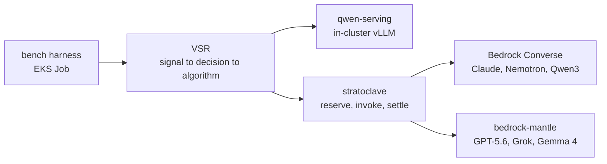

# Mixture-of-Models benchmark on EKS — design

Goal: serve vLLM Semantic Router (VSR) on EKS as a Mixture-of-Models (MoM) front door over a
heterogeneous pool — Bedrock frontier models plus a self-hosted Qwen3.8-27B — and measure what
composition buys over the best single model, under matched active compute.

Status: complete for MMLU-Pro. The gateway leg and VSR are deployed and verified live
(`RUNBOOK.md`), the harness is in `bench/`, and the held-out result is in
`RESULTS.md`. In short: routing bought no accuracy, and the router's selector named one
member for 96% of requests; the 40% cost saving came from choosing a better single
model, which needs measurement rather than a router.

Two pool corrections since the table below was written. `qwen3-235b-a22b-2507`
is offered only outside the configured residency policy, so the registered Qwen
member is `qwen3-next-80b-a3b`; and because `gpt-5.5` is retired, `gpt-5.6-terra`
takes the second OpenAI-family slot. The self-hosted Qwen3.8-27B is a tenth
member rather than one of the nine.

The gateway now serves all nine pool members from one OpenAI-compatible endpoint,
`POST /v1/chat/completions` on stratoclave (task definition 41, image
`chatcc-773b1c5`, branch `feat/chat-completions-all-registry-models`). Verified
2026-08-24 against the running service: nine models answered, and streamed mantle
calls settle with non-zero token counts, so the pool is billable and measurable.
`gpt-5.5` is dropped — it exists on neither Bedrock nor bedrock-mantle.

## Pool

Nine members requested. Every row below is a probe result from 2026-08-24, not a docs claim.

| Member | Route | Upstream | Region | Verified |
|---|---|---|---|---|
| Claude Fable 5 | stratoclave `/v1/chat/completions` | Bedrock Converse | us-east-1 | OK |
| Claude Opus 5 | stratoclave `/v1/chat/completions` | Bedrock Converse | us-east-1 | OK |
| Claude Sonnet 5 | stratoclave (registry entry to add) | Bedrock Converse | us-east-1 | Converse OK; not in registry |
| GPT-5.6 Sol | stratoclave (chat route to widen) | bedrock-mantle `/openai/v1/chat/completions` | us-east-2 | OK |
| Grok 4.6 | stratoclave (chat route to widen) | bedrock-mantle `/openai/v1/chat/completions` | us-west-2 | OK |
| Gemma 4 31B | stratoclave (chat route to widen) | bedrock-mantle `/openai/v1/chat/completions` | us-east-2 | OK |
| Nemotron Super 3 120B | stratoclave (registry entry to add) | Bedrock Converse | us-west-2 | OK |
| Qwen3 235B A22B | stratoclave (registry entry to add) | Bedrock Converse | us-west-2 | OK |
| Qwen3.8-27B (self-hosted) | direct in-cluster | vLLM FP8 + MTP, g6e.12xlarge | ap-northeast-1 | OK |

GPT-5.5 is **not reachable**: `openai.gpt-5.5` returns `The provided model identifier is invalid`
on bedrock-runtime and `does not exist` on bedrock-mantle. It appears retired. `gpt-5.6-terra` is
the substitute if a second OpenAI-family member is wanted.

## Why a gateway is required

VSR supports exactly two upstream wire formats — `api_format: openai` and `api_format: anthropic`
(`src/semantic-router/pkg/config/config.go`, `APIFormatOpenAI` / `APIFormatAnthropic`). It has no
SigV4 signer and no OpenAI Responses API client. Bedrock needs SigV4 on every call. So VSR cannot
address Bedrock directly, and it cannot use stratoclave's existing `/openai/v1/responses` surface.

stratoclave is the gateway. It already terminates the two upstreams this pool needs:

- Bedrock Converse via boto3 (`backend/mvp/_converse_core.py`, region per registry entry)
- bedrock-mantle via httpx to `https://bedrock-mantle.{region}.api.aws/openai/v1`
  (`backend/mvp/openai_responses.py`)

and it enforces per-user token quotas and per-tenant dollar pools with DynamoDB reservations
before the model is invoked. That accounting is not incidental: the MoM evaluation discipline
requires reporting calls, tokens and cost alongside quality, and the gateway is where those
numbers are already recorded.

## stratoclave gap and the change

`POST /v1/chat/completions` already exists and speaks OpenAI Chat Completions, but resolves the
model through the legacy Anthropic-only resolver `resolve_bedrock_model()`, so every non-Claude ID
is rejected with `Only Claude family models are supported by the Anthropic Messages route`.
Measured today: `claude-fable-5` 200; `google.gemma-4-31b`, `openai.gpt-5.6-sol`, `xai.grok-4.6`,
`nvidia.nemotron-super-3-120b`, `qwen.qwen3-235b-a22b-2507-v1:0`, `us.anthropic.claude-sonnet-5`
all 400. `/openai/v1/chat/completions` is 404 — the OpenAI surface is Responses-only.

Three changes, all additive:

1. **Registry** (`backend/mvp/models.py`) — extend the `provider` literal with `nvidia` and `qwen`;
   add entries for `us.anthropic.claude-sonnet-5`, `nvidia.nemotron-super-3-120b` and
   `qwen.qwen3-235b-a22b-2507-v1:0`. All three ride the existing Converse transport
   (`wire_protocol="messages"`), so no new transport is introduced. `resolve_bedrock_model()`
   filters on `provider == "anthropic"`, so the two non-Anthropic entries stay out of the
   `/v1/messages` route by construction.
2. **Chat route** (`backend/mvp/chat_completions.py`) — resolve through `resolve_model()` instead of
   `resolve_bedrock_model()` and dispatch on `wire_protocol`: `messages` keeps the Converse path but
   binds the client to `entry.bedrock_region` via `client_for_model()` (nemotron and qwen are
   us-west-2, Claude is us-east-1); `responses` forwards to bedrock-mantle's native
   `/openai/v1/chat/completions`, reusing the existing mantle client and bearer minting.
3. **Pricing** — add rate rows for the new pricing keys. Unpriced tiers default high rather than
   low, matching the existing `gemma` precedent of deliberate over-charge.

Scope reuses the `responses:send` permission for the widened route rather than minting a new scope,
so no role-grant or API-key migration is needed.

## Topology

## Measurement rules

Every run records calls, prompt and completion tokens, wall-clock latency and gateway-reported cost
per member. Single-model baselines run through the same VSR data path with a hard model pin, so the
router is not a free variable. The gateway's rate table is the cost source of record; the harness
does not invent rates.

### Compute is not what is being matched

"Matched active compute" is the wrong frame for this pool and is not claimed. The members are
proprietary APIs: their FLOPs are unobservable, their prices carry a vendor's margin, three of them
are deliberately over-charged by our own rate table, and the reasoning-capable ones bill hidden
thinking tokens. What can be matched is **observed dollar cost**, which is also the variable an
operator actually decides on. So the comparison is stated as *matched observed cost*, and no claim
is made about model efficiency.

### The baseline is the mixture frontier, not the best single model

Answering with member A at probability `p` and member B otherwise lands exactly on the segment
between their two points in the cost-accuracy plane, and requires no router. Every point on the
upper-left convex hull of the single-member points is therefore already available by coin flip. A
routing arm has bought something only if it sits **above that hull**; comparing it against the best
single member alone would credit routing for a result a coin flip reaches. The headline results are
consequently two slices of the frontier: cost reduction at accuracy indistinguishable from the best
single member, and accuracy gain at the cost of the cheapest one.

### What the router can and cannot express

VSR's `multi_factor` selector scores `wQ*quality + wL*latency + wC*cost + wLoad*load`, and its
quality term reads a **single static number per model card** (`params.QualityScore`,
`selection/multi_factor.go:223`). There is no per-domain quality anywhere in the schema. So the
stock selector cannot express "this member is stronger at chemistry", and any per-domain effect
must come from narrowing the candidate set per decision — which is an assignment policy we fit, not
something the router discovered. The report separates the two:

| Arm | What it measures |
| --- | --- |
| `pinned:<member>` | each member alone, same data path |
| `routed:multi_factor` | the stock selector, static quality |
| `domain_static:true_label` | our fitted assignment, given the true category |
| `domain_static:classifier_label` | the same assignment, given the classifier's guess |
| `global_static` | the same fitting rule with no domain split |

`domain_static:true_label` minus `domain_static:classifier_label` isolates classification error;
`domain_static` minus `global_static` isolates whether the domain split bought anything at all.

### The assignment rule, fixed in advance

For each domain, keep the members whose calibration accuracy is not distinguishable from the best
one by a paired McNemar test, then take the cheapest of those. The rule is arithmetic, so nothing is
tuned after the test fold is opened, and resolving a statistical tie by price is the thesis applied
rather than a thumb on the scale. It is implemented in `bench/harness/policies.py`
(`fit_domain_assignment`) so the code and the claim cannot drift apart.

### Folds

Questions are assigned to calibration (35%), validation (15%) and test (50%) by hashing the question
id with a fixed salt. The assignment is a pure function of the id, so it needs no manifest and cannot
drift between a calibration run and a test run weeks later. The policy is fitted on calibration,
its free parameters chosen on validation, and the test fold is scored once.

### Upper bounds, and why one of them is inflated

The existential bound — correct wherever any member was correct — is reported with the cheapest
correct member's cost, and always beside the **guessing union** for the same pool size. Over
ten-option questions, ten independent guessers reach `1 - 0.9^10 = 65%` between them while knowing
nothing, so a large fraction of that bound is the answer format rather than the pool. It is reported
as an existential bound no input-time router is guaranteed to reach, and progress toward it is
expressed as gap coverage rather than as "X% of oracle".

### Measured facts that constrain the run

Each of these was measured against the live deployment on 2026-08-25, not assumed.

- **No temperature is legal across the pool.** Claude 5 rejects the field as deprecated, GPT-5.6
  accepts only its default of 1, and the rest accept 0. The harness therefore sends no temperature
  and every member decodes at its own default. That costs determinism; sending a different value per
  member would cost comparability, which is the thing being measured.
- **The completion budget is a measurement, not a preference.** On the same 40 calls, a budget of 64
  tokens left 4 of 10 members unable to emit a letter, 512 left 6 answers of 40 unparsed, and 2048
  left 2. The members that run out are the reasoning-capable ones. A tight budget does not measure
  knowledge; it measures verbosity and charges it as error. Runs use 2048 and report the per-member
  unparsed rate as an audit.
- **Reasoning is controllable but not uniformly.** `reasoning_effort` passes through the gateway;
  `none` gives GPT-5.6 a 5-token answer, but Grok needs `minimal` and rejects nothing, while GPT
  rejects `minimal`. Since the supported value sets differ, the main run leaves reasoning at each
  member's default and reports it as a cost, not a knob.
- **A ten-member matrix costs about 4,650 gateway-charged tokens per question** at a 2048 budget —
  measured over the 4,880-call calibration run, at 465 tokens per call. An early four-question probe
  suggested nearly double that, because reasoning members are far more verbose on a handful of hard
  questions than on average.
- **The measurement is not the only thing drawing on the balance.** Second-opinion tooling routed
  through the same gateway is charged to the same pool: during this project two code reviews sent
  through it cost more than the calibration run did. A balance delta read as "what the benchmark
  cost" was several times too high. Attribution therefore comes from the harness's own records
  (`analyze.py` prints it), with the balance used only as a sanity check.
- **The classification API needs two changes to be reachable in-cluster.** It binds to
  `127.0.0.1:8080` by default, so the Service's `classify-api` port advertised an endpoint nothing
  could connect to. Widening `management_api.bind_address` alone makes the router refuse to start it
  at all — a non-loopback address demands either `remote_exposure`, which is about exposure beyond
  the cluster, or `VLLM_SR_MANAGEMENT_INTERNAL_LISTENER=true` to acknowledge a container-local
  listener. Both are now set: the bind in the generated config, the env var on the router container.
- **The classifier is the shared bottleneck, and a classification sweep costs a measurement four
  fifths of its throughput.** The router classifies every request on the data path, including a
  pinned one, and the classifier appears to serialise. Measured on the test-fold run: 23 calls per
  minute while a 1,400-question sweep ran beside it, and 100 calls per minute within four minutes of
  stopping the sweep. The two are never run concurrently, and latencies recorded during an overlap
  are inflated — spread across arms rather than concentrated, because the run order is shuffled.
- **The semantic cache is enabled, and has never served a hit.** The router's startup log reports
  `sem_cache_enabled: true`, which matters more here than it would elsewhere: the paired design asks
  every member the same question, so a hit would return an answer with the cost and latency of
  nothing and flatter whichever arm asked second. Across 4,880 calibration calls, every response
  carried `x-vsr-response-path: upstream`. This is checked rather than assumed — `analyze.py` refuses
  to report if any scored call took another path.

## Cluster facts

`distai-eks` in ap-northeast-1, Karpenter with EC2NodeClass `gpu-ddp`. The `gpu-l40s` NodePool is
shared and its live spec carries a zone pin (`ap-northeast-1a`) that this repo's manifest does not,
so applying the manifest would drift-replace nodes and evict unrelated GPU work. Deploys against
this cluster must pass `--skip-gpu`. The NodePool disruption budget is `10%`, which floors to zero
allowed disruptions at three nodes, so empty GPU nodes need an explicit `kubectl delete nodeclaim`
rather than waiting for consolidation.
